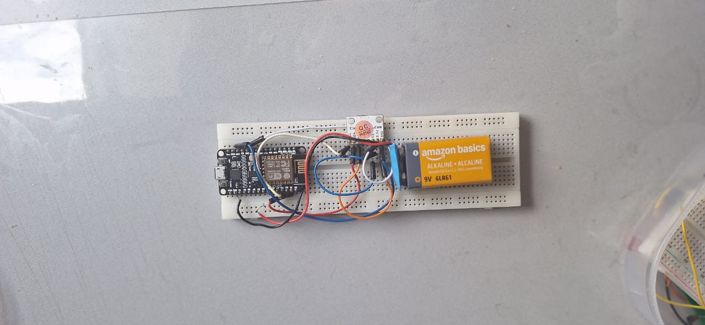

# 🚀 ROS2 Wireless Motion Interface

## 📌 Présentation

Ce projet présente un système embarqué basé sur **ROS2** permettant de contrôler une simulation robotique (**TurtleSim**) à partir d'un accéléromètre **ADXL345** connecté à un **ESP8266**.

Les mouvements de l'utilisateur sont mesurés par l'accéléromètre puis transmis sans fil par Wi-Fi vers un ordinateur exécutant ROS2.

Les données reçues sont ensuite traitées par plusieurs nœuds ROS2 afin de générer des commandes de déplacement pour la tortue simulée.

La position du robot virtuel est finalement récupérée et envoyée vers un **Arduino Nano** via une liaison série afin d'afficher les informations sur un écran LCD.



---

# 🎯 Objectifs du projet

Les objectifs principaux de ce projet sont :

- Contrôler un robot virtuel à partir d'un capteur inertiel.
- Mettre en place une architecture distribuée basée sur ROS2.
- Comprendre les concepts fondamentaux de ROS2 :
  - nœuds (`nodes`) ;
  - topics ;
  - communication publication/abonnement.
- Réaliser une communication sans fil entre un système embarqué et ROS2.
- Traiter des données issues d'un capteur en temps réel.
- Préparer une architecture pouvant évoluer vers un robot réel.

---

# 🏗️ Architecture du système

L'architecture globale du système est organisée autour de plusieurs modules :

```text
ADXL345
    |
    | Communication I²C
    ↓
ESP8266
    |
    | Wi-Fi HTTP
    ↓
esp_receiver_node
    |
    | /accel
    ↓
turtle_control
    |
    | /turtle1/cmd_vel
    ↓
turtlesim_node
    |
    | /turtle1/pose
    ↓
turtle_pose_serial_node
    |
    | USB Serial
    ↓
Arduino Nano
    |
    ↓
LCD Display
```

La description détaillée de l'architecture est disponible ici :

[Architecture du système](docs/architecture.md)

---

# ⚙️ Technologies utilisées

| Technologie | Utilisation |
|---|---|
| ROS2 Humble | Communication robotique et traitement des données |
| Python / rclpy | Développement des nœuds ROS2 |
| ESP8266 | Acquisition et communication Wi-Fi |
| ADXL345 | Mesure des accélérations |
| Arduino Nano | Gestion de l'affichage |
| TurtleSim | Simulation robotique |
| HTTP | Communication ESP8266 → ROS2 |
| UART USB | Communication ROS2 → Arduino |

## Documentation externe

- ROS2 Humble :  
https://docs.ros.org/en/humble/

- Concepts ROS2 :  
https://docs.ros.org/en/humble/Concepts.html

- ESP8266 :  
https://randomnerdtutorials.com/esp8266/

- ADXL345 :  
https://learn.adafruit.com/adxl345-digital-accelerometer

---

# 🧠 Fonctionnement du système

Le fonctionnement global suit les étapes suivantes :

1. L'utilisateur incline le capteur ADXL345.
2. L'ESP8266 récupère les valeurs d'accélération selon les axes X, Y et Z.
3. Les données sont envoyées par Wi-Fi grâce à une requête HTTP.
4. Le nœud ROS2 `esp_receiver_node` reçoit les données et publie le topic `/accel`.
5. Le nœud `turtle_control` transforme les données en commandes de vitesse.
6. Le simulateur TurtleSim réalise le déplacement demandé.
7. La position du robot est récupérée via le topic `/turtle1/pose`.
8. Les informations sont transmises vers l'Arduino Nano par liaison série.
9. L'Arduino affiche les informations sur l'écran LCD.

---

# 🎥 Démonstration

Une démonstration du fonctionnement complet du système est disponible dans la vidéo suivante :

[▶️ Voir la démonstration du projet](https://youtu.be/UxNKkSdeY-A)

---
# 🧩 Nœuds ROS2

| Nœud | Fonction |
|---|---|
| `esp_receiver_node` | Réception des données ESP8266 et publication du topic `/accel` |
| `turtle_control` | Conversion des données d'accélération en commandes de mouvement |
| `turtlesim_node` | Simulation du robot mobile |
| `turtle_pose_serial_node` | Transmission de la position vers Arduino |

Documentation :

[Description des nœuds ROS2](docs/ros_nodes.md)

---

# 📡 Topics ROS2 utilisés

| Topic | Description |
|---|---|
| `/accel` | Données d'accélération X, Y, Z |
| `/turtle1/cmd_vel` | Commandes de vitesse du robot |
| `/turtle1/pose` | Position et orientation de la tortue |

Documentation :

[Communication du système](docs/communication.md)

---

# 📦 Matériel utilisé

| Composant | Fonction |
|---|---|
| ESP8266 | Transmission Wi-Fi |
| ADXL345 | Mesure d'accélération |
| Arduino Nano | Affichage des informations |
| LCD I²C | Interface utilisateur |
| PC | Exécution de ROS2 |

Documentation :

[Matériel utilisé](docs/hardware.md)

---

# 📥 Prérequis

Avant de lancer le projet, il faut disposer de :

- Ubuntu 22.04 ;
- ROS2 Humble ;
- Python 3 ;
- Arduino IDE ;
- ESP8266 configuré ;
- un réseau Wi-Fi commun entre l'ESP8266 et le PC.

Guide d'installation :

[Installation du projet](docs/installation.md)

---

# 🚀 Lancement du projet

Compiler le workspace ROS2 :

```bash
cd ~/ros2_ws

colcon build

source install/setup.bash
```

Lancer ensuite le système :

```bash
ros2 launch accel_system_cmd accel_turtle.launch.py
```

---

# 🛠️ Dépannage

En cas de problème concernant :

- la communication ESP8266 / ROS2 ;
- la connexion réseau ;
- le lancement des nœuds ;
- la communication série Arduino ;

consulter :

[Problèmes rencontrés et solutions](docs/troubleshooting.md)

---

# 📂 Organisation du projet

```text
ros2_ws/
│
├── src/
│   └── accel_system_cmd/
│       ├── launch/
│       ├── accel_system_cmd/
│       └── setup.py
│
└── docs/
    ├── architecture.md
    ├── ros_nodes.md
    ├── communication.md
    ├── hardware.md
    ├── installation.md
    └── troubleshooting.md
```

---

# 🔮 Évolutions possibles

Les améliorations possibles du système sont :

- remplacement de TurtleSim par un robot réel ;
- ajout d'autres capteurs ;
- amélioration du filtrage des données inertielle ;
- création d'une interface graphique ;
- utilisation d'une communication adaptée aux systèmes robotiques distribués.