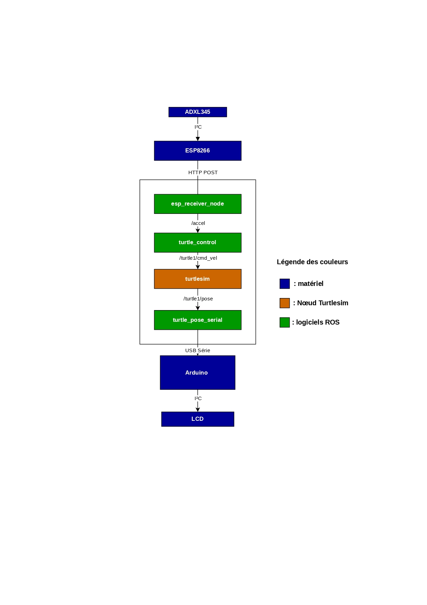

# Architecture du système

## 1. Introduction

Ce document présente l'architecture matérielle et logicielle mise en place pour réaliser un système de contrôle robotique basé sur ROS2.

Le projet repose sur une architecture distribuée permettant de contrôler une simulation robotique à partir des données fournies par un capteur inertiel. Un accéléromètre ADXL345 connecté à un ESP8266 permet de récupérer les mouvements de l'utilisateur et de transmettre les mesures vers un ordinateur exécutant ROS2.

Le traitement des données est réalisé au sein de l'environnement ROS2 grâce à plusieurs nœuds indépendants communiquant via des topics. Les informations issues du capteur sont transformées en commandes de déplacement pour le simulateur TurtleSim.

Afin de compléter l'architecture, la position du robot simulé est récupérée puis transmise vers un microcontrôleur Arduino Nano via une liaison série. L'Arduino assure ensuite l'affichage des informations sur un écran LCD.

Cette séparation des fonctions permet d'obtenir une architecture modulaire, dans laquelle chaque élément possède un rôle précis :
- acquisition des données par l'ESP8266 ;
- traitement et communication par ROS2 ;
- restitution des informations par l'Arduino.

## 2. Vue générale de l'architecture

L'architecture globale du système est organisée autour de trois parties principales :

- **La partie acquisition**, chargée de récupérer les informations issues du capteur inertiel.
- **La partie traitement**, basée sur ROS2, qui assure la communication entre les différents modules et réalise la conversion des données en commandes de mouvement.
- **La partie restitution**, permettant d'afficher les informations issues du système grâce à un Arduino Nano associé à un écran LCD.



Le fonctionnement global suit le cheminement suivant :

1. L'accéléromètre ADXL345 mesure les accélérations selon les axes X, Y et Z.
2. L'ESP8266 récupère ces mesures via une communication I²C et les transmet au réseau Wi-Fi.
3. Un nœud ROS2 reçoit les données envoyées par l'ESP8266 et les publie sous forme de messages ROS.
4. Le nœud de contrôle traite ces informations afin de générer les commandes de déplacement destinées à TurtleSim.
5. Le simulateur TurtleSim exécute les mouvements demandés et publie sa position actuelle.
6. La position de la tortue est récupérée puis envoyée vers l'Arduino Nano par une liaison série.
7. L'Arduino affiche les informations reçues sur l'écran LCD.

Cette organisation permet de séparer clairement les fonctions du système et facilite l'ajout de nouveaux modules dans le futur.
## 3. Description des différents blocs

### 3.1 Capteur ADXL345

L'ADXL345 est un accéléromètre numérique trois axes utilisé pour détecter les mouvements et les inclinaisons de l'utilisateur.

Le capteur mesure les accélérations selon trois axes :

- Axe X : mouvement latéral gauche/droite.
- Axe Y : mouvement avant/arrière.
- Axe Z : accélération suivant l'axe vertical.

Les données acquises sont transmises à l'ESP8266 grâce au protocole de communication I²C. Cette liaison permet une communication rapide avec un nombre limité de connexions électriques.

Dans ce projet, l'ADXL345 joue le rôle d'interface entre le mouvement physique de l'utilisateur et le système de contrôle robotique. Les variations des axes mesurés sont ensuite interprétées afin de générer les commandes de déplacement du robot simulé.

### 3.2 ESP8266

L'ESP8266 est utilisé comme unité d'acquisition et de communication sans fil.

Ses principales fonctions dans le système sont :

- Lire les données provenant de l'ADXL345 via le bus I²C.
- Effectuer une première mise en forme des mesures.
- Établir une connexion Wi-Fi avec l'ordinateur exécutant ROS2.
- Transmettre les données d'accélération vers le système ROS2.

Le choix de l'ESP8266 est lié à son faible coût, sa faible consommation énergétique et surtout à son module Wi-Fi intégré, permettant de créer facilement une liaison sans fil entre la partie capteur et la partie traitement.

La communication entre l'ESP8266 et ROS2 est réalisée grâce à un échange de données basé sur le protocole HTTP.

### 3.3 Architecture ROS2

ROS2 (Robot Operating System 2) constitue la couche principale de traitement et de communication du système.

Contrairement à un programme monolithique où toutes les fonctions seraient regroupées dans un seul programme, ROS2 permet de diviser l'application en plusieurs composants indépendants appelés **nœuds (nodes)**.

Chaque nœud possède une fonction précise et communique avec les autres grâce à un système de publication et d'abonnement basé sur les **topics**.

Dans ce projet, ROS2 assure plusieurs rôles :

- Réception des données provenant de l'ESP8266.
- Traitement des mesures de l'accéléromètre.
- Génération des commandes de déplacement.
- Récupération de la position du robot simulé.
- Transmission des informations vers l'Arduino.

L'architecture ROS2 mise en place est composée de plusieurs nœuds :

| Nœud | Fonction |
|---|---|
| `esp_receiver_node` | Réception des données envoyées par l'ESP8266 et publication du topic `/accel` |
| `turtle_control` | Conversion des données d'accélération en commandes de vitesse |
| `turtlesim_node` | Simulation du robot mobile |
| `turtle_pose_serial_node` | Transmission de la position vers l'Arduino via liaison série |

---

### 3.3.1 Communication par topics

La communication entre les différents nœuds ROS2 repose sur des topics.

Un topic permet à un nœud de publier des informations sans connaître directement le nœud qui les utilise. Cette architecture apporte une meilleure modularité et facilite l'ajout de nouveaux composants.

Les principaux topics utilisés dans ce projet sont :

| Topic | Type de données | Rôle |
|---|---|---|
| `/accel` | Données d'accélération | Transmission des valeurs X, Y, Z provenant du capteur |
| `/turtle1/cmd_vel` | Commande de vitesse | Contrôle du déplacement de TurtleSim |
| `/turtle1/pose` | Position du robot | Récupération de la position et de l'orientation |

Le flux de communication ROS2 peut être résumé ainsi :
```text
ESP8266
   |
   | Données accélération
   ↓
esp_receiver_node
   |
   | /accel
   ↓
turtle_control
   |
   | /turtle1/cmd_vel
   ↓
turtlesim_node
   |
   | /turtle1/pose
   ↓
turtle_pose_serial_node
```

Cette organisation permet de séparer les différentes fonctions du système et de rendre l'architecture facilement évolutive.

## 4. Flux des données

Le fonctionnement du système repose sur une chaîne complète d'acquisition, de traitement et de restitution des informations.

Le déplacement de l'utilisateur est d'abord mesuré par l'accéléromètre ADXL345. Les valeurs d'accélération selon les axes X, Y et Z sont ensuite transmises à l'ESP8266 qui assure la communication sans fil avec l'ordinateur exécutant ROS2.

Le flux global des données est le suivant :

```text
Mouvement utilisateur
        |
        ↓
ADXL345
        |
        | Communication I²C
        ↓
ESP8266
        |
        | Wi-Fi HTTP POST
        ↓
esp_receiver_node
        |
        | Topic /accel
        ↓
turtle_control
        |
        | Topic /turtle1/cmd_vel
        ↓
turtlesim_node
        |
        | Topic /turtle1/pose
        ↓
turtle_pose_serial_node
        |
        | Liaison série USB
        ↓
Arduino Nano
        |
        ↓
Écran LCD 
```

Chaque étape correspond à une fonction spécifique :

### 4.1 Acquisition des données

L'ADXL345 mesure les accélérations suivant les trois axes. Ces informations représentent les mouvements et les inclinaisons appliqués par l'utilisateur.

Les valeurs mesurées sont ensuite transmises à l'ESP8266 afin d'être traitées et envoyées vers le système ROS2.

---

### 4.2 Transmission sans fil

L'ESP8266 récupère les données du capteur via le protocole de communication I²C.

Après acquisition, les mesures sont mises en forme sous la forme d'un message contenant les valeurs des trois axes :

- accélération selon X ;
- accélération selon Y ;
- accélération selon Z.

Ces données sont ensuite transmises au système ROS2 par une requête HTTP POST via le réseau Wi-Fi.

---

### 4.3 Réception et traitement ROS2

Le nœud `esp_receiver_node` assure l'interface entre l'ESP8266 et l'environnement ROS2.

Son rôle est de :

- recevoir les données envoyées par l'ESP8266 ;
- extraire les valeurs X, Y et Z ;
- publier ces informations sur le topic `/accel`.

Le nœud `turtle_control` récupère ensuite ces données afin de les convertir en commandes de déplacement.

Il génère les messages de vitesse envoyés au simulateur grâce au topic `/turtle1/cmd_vel`.

---

### 4.4 Simulation robotique

Le nœud `turtlesim_node` reçoit les commandes de déplacement publiées sur le topic `/turtle1/cmd_vel`.

À partir de ces informations, il met à jour :

- la position de la tortue ;
- son orientation ;
- son déplacement dans l'environnement simulé.

La position actuelle est ensuite publiée sur le topic `/turtle1/pose`.

---

### 4.5 Retour d'information

Le nœud `turtle_pose_serial_node` récupère les informations de position publiées par TurtleSim sur le topic `/turtle1/pose`.

Ces données sont ensuite converties puis envoyées vers l'Arduino Nano via une liaison série USB.

L'Arduino traite les informations reçues et assure l'affichage sur l'écran LCD, permettant à l'utilisateur d'obtenir un retour visuel sur l'état du système.

## 5. Choix d'architecture

L'architecture du système a été conçue afin de garantir une bonne modularité, de faciliter la maintenance du code et de permettre l'évolution du projet vers des applications robotiques plus complexes.

Les principaux choix de conception sont présentés ci-dessous.

### 5.1 Architecture distribuée

Le système est organisé autour de plusieurs composants indépendants, chacun étant responsable d'une fonction bien définie.

- **ADXL345** : mesure les accélérations selon les axes X, Y et Z.
- **ESP8266** : acquiert les données du capteur et les transmet via le réseau Wi-Fi.
- **ROS2** : reçoit les données, les traite et pilote la simulation.
- **Arduino Nano** : reçoit les informations de position et les affiche sur un écran LCD.

Cette séparation présente plusieurs avantages :

- meilleure lisibilité de l'architecture ;
- maintenance simplifiée ;
- possibilité de modifier un composant sans impacter les autres ;
- ajout facile de nouvelles fonctionnalités.

---

### 5.2 Choix de ROS2

ROS2 constitue le cœur logiciel du projet.

Son architecture basée sur des **nœuds** et des **topics** permet de développer des applications robotiques de manière modulaire.

Les principaux avantages de ROS2 dans ce projet sont :

- découpage de l'application en plusieurs nœuds indépendants ;
- communication standardisée grâce au mécanisme de publication/abonnement ;
- facilité de débogage de chaque composant ;
- compatibilité avec de nombreux outils de simulation robotique.

Cette approche permet également d'envisager le remplacement futur de TurtleSim par un robot réel sans modifier profondément l'architecture logicielle.

---

### 5.3 Choix de l'ESP8266

L'ESP8266 est utilisé comme passerelle entre le capteur et le système ROS2.

Ce choix est motivé par plusieurs caractéristiques :

- module Wi-Fi intégré ;
- faible coût ;
- faible consommation énergétique ;
- facilité de programmation avec l'IDE Arduino ;
- compatibilité avec le capteur ADXL345.

Dans cette architecture, son rôle est volontairement limité à l'acquisition et à la transmission des données afin de conserver une bonne séparation entre les fonctions matérielles et logicielles.

---

### 5.4 Choix de l'Arduino Nano

L'Arduino Nano est utilisé exclusivement pour la restitution des informations vers l'utilisateur.

Il reçoit les données envoyées par ROS2 via une liaison série USB puis les affiche sur un écran LCD.

Cette séparation présente plusieurs avantages :

- simplification de la gestion de l'affichage ;
- diminution de la charge des nœuds ROS2 ;
- possibilité de remplacer facilement le dispositif d'affichage ;
- meilleure organisation de l'architecture matérielle.

L'Arduino joue ainsi le rôle d'interface utilisateur sans intervenir dans le traitement des données.

---

## 6. Évolutions possibles

L'architecture développée constitue une base de travail pouvant être enrichie afin de répondre à des besoins plus avancés en robotique.

Plusieurs améliorations peuvent être envisagées.

### 6.1 Utilisation d'un robot réel

Le simulateur TurtleSim pourrait être remplacé par un robot mobile réel piloté par ROS2.

Cette évolution permettrait de conserver une grande partie de l'architecture logicielle déjà développée.

---

### 6.2 Amélioration de la communication

La communication HTTP utilisée dans ce projet pourrait être remplacée par un protocole plus adapté aux applications robotiques distribuées, tel que **MQTT**, afin d'améliorer les performances et la fiabilité des échanges.

---

### 6.3 Ajout de nouveaux capteurs

L'architecture permet d'intégrer facilement d'autres capteurs, par exemple :

- gyroscope ;
- caméra ;
- capteurs à ultrasons ;
- GPS ;
- centrale inertielle (IMU).

Ces nouveaux capteurs pourraient enrichir les informations disponibles pour le contrôle du robot.

---

### 6.4 Amélioration de l'interface utilisateur

L'écran LCD pourrait être complété ou remplacé par :

- une matrice LED ;
- une interface graphique sur ordinateur ;
- une application mobile ;
- un tableau de bord Web.

Ces solutions offriraient un retour d'information plus riche et plus interactif.

---

### 6.5 Amélioration des algorithmes

Le contrôle du robot pourrait être perfectionné grâce à :

- un filtrage plus avancé des mesures de l'accéléromètre ;
- une meilleure prise en compte des mouvements involontaires ;
- une adaptation automatique de la sensibilité ;
- l'utilisation de méthodes de fusion de capteurs.

Ces améliorations permettraient d'obtenir un contrôle plus précis, plus fluide et plus robuste.