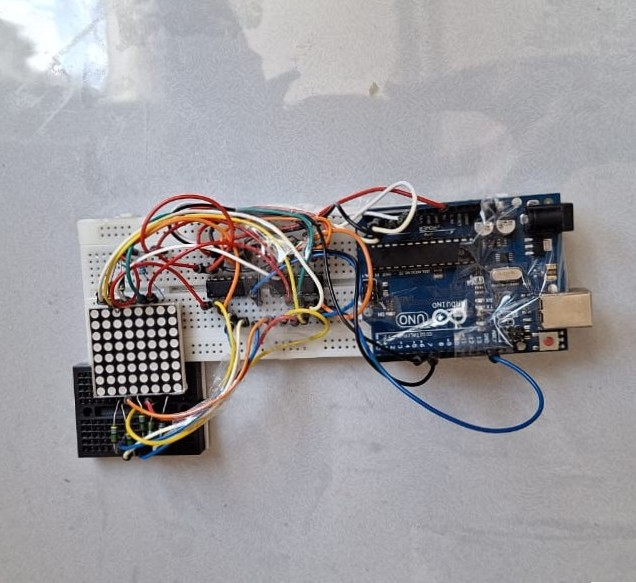
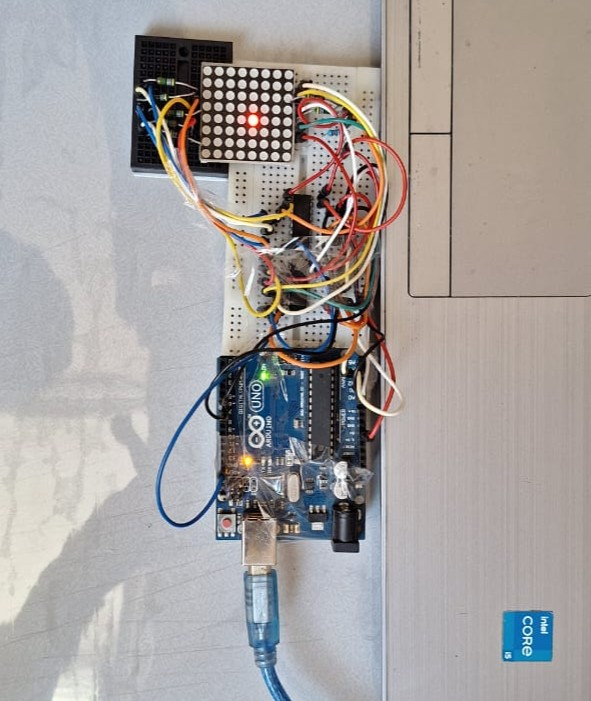

# 💡 Affichage physique de TurtleSim sur matrice LED 8x8

## 📌 Présentation

Cette partie présente l'intégration d'une matrice LED 8x8 permettant de représenter physiquement la position de la tortue simulée avec **ROS2 TurtleSim**.

L'objectif est de créer un premier lien entre un environnement robotique simulé et une représentation matérielle réelle.

La position de la tortue est récupérée depuis ROS2, convertie en coordonnées adaptées à la matrice LED puis envoyée vers un Arduino Nano via une liaison série USB.

L'Arduino utilise ensuite la bibliothèque **LedMatrix** développée pour commander un point lumineux représentant la tortue.

---

# 🎯 Objectifs

Cette extension permet de :

- représenter physiquement la position d'un robot simulé ;
- réaliser une communication ROS2 → Arduino ;
- développer une interface entre simulation et matériel réel ;
- créer une base pour une future transition vers un robot physique.

---

# 🏗️ Architecture du système


La chaîne complète est :

```
TurtleSim
    |
    | /turtle1/pose
    ↓
turtle_pose_serial_node
    |
    | USB Serial
    ↓
Arduino Nano
    |
    ↓
Bibliothèque LedMatrix
    |
    ↓
Matrice LED 8x8
```

---

# ⚙️ Fonctionnement

## 1. Récupération de la position

Le nœud ROS2 :

```
turtle_pose_serial_node
```

s'abonne au topic :

```
/turtle1/pose
```

Ce message contient :

- la position X ;
- la position Y ;
- l'orientation θ.

Exemple :

```
x = 5.6
y = 7.2
theta = 1.57
```

---

## 2. Conversion des coordonnées

Les coordonnées continues de TurtleSim doivent être adaptées à la résolution de la matrice.

TurtleSim utilise un espace :

```
0.5 → 10.5
```

alors que la matrice possède :

```
0 → 7
```

La position est donc convertie :

```
(x,y) → (x_led,y_led)
```

Exemple :

```
TurtleSim :

x = 5.5
y = 5.5


Matrice LED :

x_led = 4
y_led = 4
```

---

## 3. Communication série

Après conversion, seules les coordonnées du pixel sont envoyées à l'Arduino.

Format utilisé :

```
x,y
```

Exemple :

```
4,6
```

L'Arduino interprète cette information comme :

```
colonne = 4
ligne = 6
```

---

# 🔌 Partie matérielle

## Matériel utilisé

| Composant | Fonction |
|-|-|
| Arduino Nano | Contrôle de la matrice |
| Matrice LED 8x8 | Représentation de la tortue |
| 74HC595 | Commande des lignes et colonnes |
| PC | Exécution ROS2 |

---

## 📷 Dispositif réalisé

### Montage de commande



Le premier ensemble correspond au circuit de commande comprenant :

- Arduino Nano ;
- registres à décalage 74HC595 ;
- connexions vers la matrice LED.

---

### Affichage final



La matrice LED affiche un point lumineux représentant la position de la tortue.

---

# 📚 Bibliothèque LedMatrix

Afin de simplifier l'utilisation de la matrice, une bibliothèque dédiée a été développée.

Elle permet de commander directement les pixels sans gérer manuellement les registres 74HC595.

---

## Fonctions principales

### `begin()`

Initialise :

- les broches Arduino ;
- les registres 74HC595 ;
- l'état initial de la matrice.

---

### `setPixel(x,y,state)`

Permet de commander une LED individuelle.

Exemple :

```cpp
matrix.setPixel(3,5,true);
```

Allume le pixel situé aux coordonnées :

```
x = 3
y = 5
```

---

### `clear()`

Éteint toute la matrice.

Exemple :

```cpp
matrix.clear();
```

---

### `moveTo(x,y)`

Déplace le point représentant la tortue.

La fonction :

1. efface l'ancienne position ;
2. allume la nouvelle position ;
3. mémorise la nouvelle position.

Exemple :

```cpp
matrix.moveTo(4,6);
```

---

# 🧪 Validation du système

Plusieurs tests ont été réalisés :

## Test 1 : Communication série

Vérification de la réception :

```
4,5
```

par l'Arduino.

✅ Fonctionnel


## Test 2 : Déplacement manuel

Déplacement de la tortue dans TurtleSim.

Résultat :

Le point lumineux suit correctement la position de la tortue.

✅ Fonctionnel


## Test 3 : Système complet

Chaîne complète :

```
ADXL345
 ↓
ESP8266
 ↓
ROS2
 ↓
TurtleSim
 ↓
Arduino
 ↓
Matrice LED
```

✅ Fonctionnel

---

# 🎥 Démonstration vidéo

Une démonstration complète du système est disponible ici :

➡️ [Voir la démonstration sur YouTube](https://youtube.com/shorts/0dVLAmqQZ7Y?feature=share)

La vidéo présente :

- le contrôle de TurtleSim ;
- la transmission de la position ;
- l'affichage simultané sur la matrice LED.

---

# 🔗 Documentation complémentaire

La partie concernant :

- l'identification d'une matrice LED inconnue ;
- la détermination anode commune / cathode commune ;
- le repérage des lignes et colonnes ;
- la méthode de câblage ;

est traitée dans un projet indépendant :

➡️ **LED Matrix Analyzer**

[Lien vers le projet GitHub]

---

# 🚀 Perspectives d'évolution

Cette première version permet uniquement d'afficher la position de la tortue.

Les évolutions possibles sont :

- afficher l'orientation du robot ;
- afficher une trajectoire ;
- ajouter plusieurs points ;
- intégrer des obstacles ;
- remplacer progressivement TurtleSim par un robot réel.

---

# 📌 Conclusion

Cette extension permet de transformer une simulation ROS2 en une représentation physique simple.

Elle constitue une première étape vers la création d'un système robotique hybride combinant :

- simulation ;
- communication réseau ;
- traitement temps réel ;
- électronique embarquée.